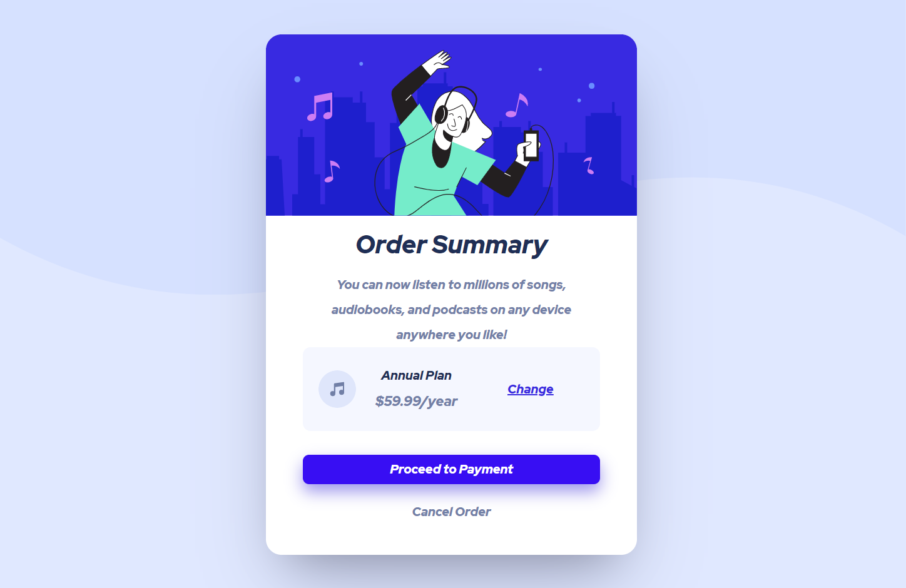

# order-summary

# Frontend Mentor - Order summary card solution

This is a solution to the [Order summary card challenge on Frontend Mentor](https://www.frontendmentor.io/challenges/order-summary-component-QlPmajDUj). Frontend Mentor challenges help you improve your coding skills by building realistic projects. 

## Table of contents

- [Overview](#overview)
  - [The challenge](#the-challenge)
  - [Screenshot](#screenshot)
  - [Links](#links)
- [My process](#my-process)
  - [Built with](#built-with)
  - [What I learned](#what-i-learned)
  - [Continued development](#continued-development)
  - [Useful resources](#useful-resources)
  - [author](#author)


## Overview

The challenge was to build out this order summary card component and get it looking as close to the design as possible.

You can use any tools you like to help you complete the challenge. So if you've got something you'd like to practice, feel free to give it a go
### The challenge

Users should be able to:

- See hover states for interactive elements
Download the project and go through the README.md file. This will provide further details about the project and help you get set up.

### Screenshot



### Links

- Solution URL: [mygithub](https://github.com/aaron-might/order-summary.git)
- Live Site URL: [netlify](https://zealous-davinci-14a737.netlify.app/)

## My process

### Built with

- Semantic HTML5 markup
- CSS custom properties
- Flexbox
- CSS Grid
- Mobile-first workflow

### What I learned

```html 
<div class="card-payment">
                    
                    <div class="sub-card-payment">
                        <h2 class="sub-heading">Annual Plan</h2>
                        <p class="paragraph">$59.99/year</p>
                    </div>
                        <a href="#" class="sub-card-payment-link">
                            Change</a>
                </div>
```
```css
body {
    font-size: 16px;
    display: -webkit-box;
    display: -ms-flexbox;
    display: flex;
    -webkit-box-pack:center;
    -ms-flex-pack:center;
    justify-content: center;
    -webkit-box-align:center;
    -ms-flex-align:center;
    align-items: center;
    -webkit-box-orient: horizontal;
    -webkit-box-direction:normal;
        -ms-flex-direction: row;
        flex-direction: row;
    width: 1000px;
    max-width:100%;
    margin:0 auto;
    height: 100vh;
    background-repeat: no-repeat;
    background-image: url(/assets/images/pattern-background-desktop.svg);
    font-family: "Red Hat Display", sans-serif;
    background-size: 100% 50%;
    background-color: #e0e8ff;

}
```

### Continued development

i would like to put more effort into learning the mediaQueries, flexbox, margin and padding and how to apply specfic to html elements.


### Useful resources

- [www.w3school.com](https://www.w3cschool.cn/doc_css/css--webkit-box-reflect.html) - This helped me for XYZ reason. I really liked this pattern and will use it going forward.
- [www.w3school.com](https://www.w3schools.com/Css/css3_gradients.asp) - This is an amazing article which helped me finally understand linear gradient and radial gradient. I'd recommend it to anyone still learning this concept.


## Author

- Frontend Mentor - [aaron-might](https://www.frontendmentor.io/profile/aaron-might)


